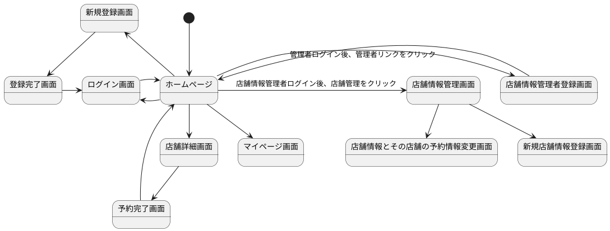

### 環境
vue:2.6.12

firebase: 8.3.1,

v-calendar: 2.3.0

### 本番環境と開発環境

masterブランチを本番環境

developブランチを開発環境で使用
開発環境で適宜ブランチを切り開発する

develop→masterへCreate a merge commitで行っている

Branch protection ruleを用いてmasterへの直pushは禁止

### 環境構築方法

### 環境構築方法
node.jsをインストール

yarnパッケージマネージャーをインストール

Vue CLIのインストール

### ページ一覧
- ホーム
- ログイン
- ログアウト
- ユーザ新規登録
- 登録完了
- マイページ
- 店舗情報詳細
- 管理者
- 店舗情報管理画面 　

### 機能一覧
- 店舗一覧表示機能
- お店の予約機能　
- 新規ユーザー登録機能
- ユーザ情報表示機能
- ユーザのお気に入り店舗登録機能
- ユーザのお気に入り店舗表示機能
- ユーザの予約表示機能
- ログイン機能
- ログアウト機能
- ショップ管理者登録機能
- ショップ情報新規作成、更新、削除機能

### 認証・認可
認証機能はfirebaseのauthenticationを利用。

firebaseで生成してIDtoken(JWT)をバックエンドで解読し自前のデーターベースで照合

認可はusersテーブルのroleカラムの値によって制限
role:1　管理者
role:2　ショップ管理者
role:3　ユーザー

### 画面遷移図

### ページ詳細と機能詳細
#### 1.ホーム画面
トップでビデオを再生しインパクトのあるデザイン。

店舗一覧、店舗検索機能を表示

ログイン等のリンクをフッターに設置

ログイン時には新規登録リンクは非表示しログアウトを表示

管理者がログインした際は管理者リンク表示

ショップ管理者がログインした際はショップ管理者リンクを表示

- 店舗検索機能：ジャンル、エリア、自由検索。and検索。自由検索は店舗情報のdescriptionの分から検索。

- お気に入り店舗登録機能:ログイン後店舗情報カードのハートマークをクリックとお気に入り登録される。
また、非ログイン時はログインを促すアラート設置

#### 2.ユーザ新規登録画面
ユーザ名、Email、パスワードを入力しバックエンドへ送信

- firebaseへユーザー情報登録機能
- バックエンドへ送信しDBへ登録

#### 3.ログイン画面
Emailとパスワードでユーザ認証

- firebaseでユーザー認証機能：firebaseで認証後、firebaseのidTokenをバックエンドへ送信し自前のデータベースで照合し存在すればユーザーIDを返す。

#### 4.マイページ画面
お気に入り店舗や予約情報を表示

- お気に入り店舗削除機能：お気に入り店舗のカードの削除ボタンをクリック

- 予約情報削除機能：予約情報の×アイコンをクリック

#### 5.店舗詳細画面
店舗名や概要等の店舗情報や予約フォームを表示

- 予約機能：予約時間や予約人数はリストから選択、予約日は「v-calender」を利用しクリックすると日付が入力される。予約ボタンを押すと登録

#### 6.予約完了画面
予約完了表示、戻るボタンでホームへ

#### 7.会員登録完了画面
会員登録完了画面、ログインボタンでログイン画面へ

#### 8.管理者画面
店舗管理者登録フォーム

- 店舗情報をDBへ登録機能：roleカラムを店舗管理者にバックエンドで設定。また、roleが管理者権限でないとはじかれる

#### 9.店舗管理者画面
店舗情報新規作成や予約や店舗情報更新へ遷移する画面。

- 店舗情報表示機能
- 店舗情報削除機能

共通：roleが店舗管理者でないとはじかれる

#### 10.店舗情報新規作成画面
店舗名、エリア等のフォームを表示

- 店舗情報新規作成機能：DBへ登録。roleが店舗管理者でないとはじかれる

#### 11.予約、店舗情報更新画面
店舗の予約ユーザ表示 
店舗情報更新フォーム表示

- 予約ユーザ削除機能：予約カードの×アイコンクリック

- 店舗情報更新機能：内容を変更後、変更ボタン

共通：roleが店舗管理者でないとはじかれる

 

